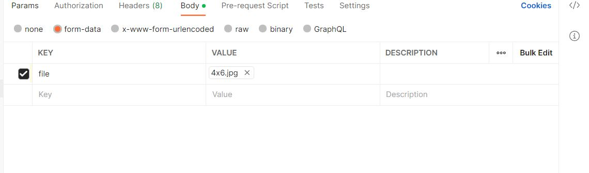
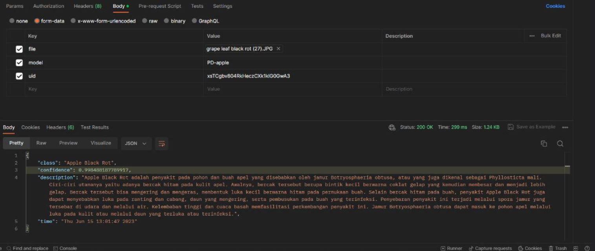

# AgroVision Cloud Computing Repository

## Cloud Architecture Diagram


## API User Authentication and User Database
### List of Endpoints

| Method     | Endpoint      	    |
| ------------- | ------------------------- |
| POST          | /userHandler  	    |
| POST          |  /signin      	    |
| POST          |  /signout     	    |
| POST          |  /userHistory 	    |
| POST          |/reset-password	    |
| PUT		|/user/:uid/name	    |
| GET		|/user/:uid		    |
| POST		|/user/:uid/profile-picture |

#### POST /userHandler

This method is used for user registration on the application.

##### Request Body Example

```json
{
    "emailField": "kfgjdfkjs@gmail.com",
    "fullnameField": "nametest",
    "passwordField": "passwordtest123"
}
```

##### Success Response Example

```json
{
    "status": "success",
    "message": "Sign-up has been successful",
    "data": {
        "uid": "kejgT4WlafYbjhcI5kn2xUPb8gh1"
    }
}
```

##### Response if There is One or More Empty Field

```json

{
      "status": "fail",
      "message": "All fields need to be filled. (Email, Full name, and Password)"
}
```

##### Response if Some Error Occurred when Creating a Document to the Database

```json
{
        "status": "fail",
        "message": "An error occurred during sign-up"
}
```


#### POST /signin

This method is used for user sign-in on the application.


##### Request Body Example

```json
{
    "email": "kfgjdfkjs@gmail.com",
    "password": "passwordtest123"
}
```

##### Success Response Example

```json
{
    "status": "success",
    "message": "Sign-in successful",
    "data": {
        "uid": "kejgT4WlafYbjhcI5kn2xUPb8gh1",
        "email": "kfgjdfkjs@gmail.com"
    }
}
```

##### Error Response if There is One or More Empty Field

```json
{
      "status": "fail",
      "message": "Email and password are required."
}
```

##### Response if Some Error Occurs when Performing The Sign-in Process

```json
{
        "status": "fail",
        "message": "An error occurred during sign-in",
}
```

#### POST /signout

This method is used for user sign-out on the application. This method doesn't require request body.

##### Success Response

```json
{
    "status": "success",
    "message": "Sign-out successful"
}
```

##### Response if Some Error Occurs when Performing The Sign-out Process
```json
{
        "status": "fail",
        "message": "An error occurred during sign-out"
}
```

#### POST /userHistory

This method is used for storing prediction results for each user in the database.

##### Request Body Example

```json
{
    "userId": "123456",
    "history": {
        "prediction1": "result1",
        "prediction2": "result2"
    }
}
```

##### Success Response

```json
{
       "message": "User history saved successfully"
}
```


#### POST /reset-password

This method is used for sending email to the user to do reset password process.

##### Request Body Example

```json
{
    "email": "example@gmail.com"
}
```

##### Success Response

```json
{
    "status": "success",
    "message": "Password reset email sent successfully."
}
```

##### Error Response if The Required Field is Empty

```json
{
      "status": "fail",
      "message": "Email is required."
}
```

##### Response if Some Error Occurs when Performing The Process of Sending an Email

```json
{
        "status": "fail",
        "message": "An error occurred while sending the password reset email."
}
```

#### PUT /user/:uid/name

This method is used for changing the name of the `uid` that was read out. The request parameter needed is the `userid`.

##### Request Body Example

```json
{
    "uid": "kejgT4WlafYbjhcI5kn2xUPb8gh1",
    "name" : "namechangetest"
}
```

##### Success Response

```json
{
    "status": "success",
    "message": "Name updated successfully."
}
```

##### Error Response if There is One or More Empty Field

```json
{
      "status": "fail",
      "message": "UID and name are required."
}
```

##### Error Response if Based on The `uid`, The Document is Not Found

```json
{
        "status": "fail",
        "message": "User not found."
}
```

##### Error Response when Performing Name Changing

```json
{
      "status": "fail",
      "message": "An error occurred while updating name."
}
```

#### GET /user/:uid

This method is used to get user information based on the `uid` that was read out. This method doesn't require a request body, rather just needs the `uid` from the user.

##### Success Response Example

```json
{
    "status": "Success",
    "user": {
        "uid": "user_id_yang_terinput",
        "email": "example@gmail.com"
    }
}
```

##### Error Response if There is No Document Exist for Specific `uid`

```json
{
        "status": "Failed",
        "message": "Data not found"
}
``` 

##### Error Response on Failing to Get User Information

```json
{
      "status": "Failed",
      "message": "Error retrieving user data"
}
```


#### POST /user/:uid/profile-picture

This method is used to input the user profile picture. The request parameter needed is the `uid` of a specific user. The request body is in a file format as shown in the screenshot below.




##### Success Response

```json
{
      "status": "success",
      "message": "Profile picture added successfully."
}
```

##### Error Response if There is One or More Empty Field

```json
{
      "status": "fail",
      "message": "UID and profile picture are required."
}
```

##### Error Response if There is No Document with Specific `uid`

```json
{
       "status": "fail",
        "message": "User not found."
}
```

##### Error Response when Performing Profile Picture Addition

```json
{
     "status": "fail",
      "message": "An error occurred while adding profile picture."
}
```

# ML API Service

In order to use the ML API Service, the user needs to send form data to the server using the POST method. Here are the things that need to be included in the form data.

### `file`

This is an image file that is needed for inference purpose using the machine learning model that was developed before by the Machine Learning Engineers. Based on the test that has been conducted, the appropriate image format is .JPG.

### `model`

This key is used for specifying which machine learning model that will be loaded to perform the inferencing process. The value format for this key is `PD-model_name` or `FP-model_name`, where "PD" is indicating the plant crop disease models and "FP" indicating the fruit and vegetable ripeness models.

Example: `PD-Grape` will refer to loading the plant crop disease model that has been trained for identifying the grape plant crop disease classes.

### `uid`

This key is used for defining the storage location of all the inference results for each specific user based on their `uid`. The response field's names are the same as the field names that have been defined inside the Firebase Auth and Firestore.

#### Success Response Example

```json
{
    "class" : "Sifat_Terdeteksi",
    "confidence" : "0.7675789",
    "description" : "Deskripsi_untuk_sifat_terdeteksi",
    "time" : "Mon Jun 12 15:24:12 2023"
}
```


